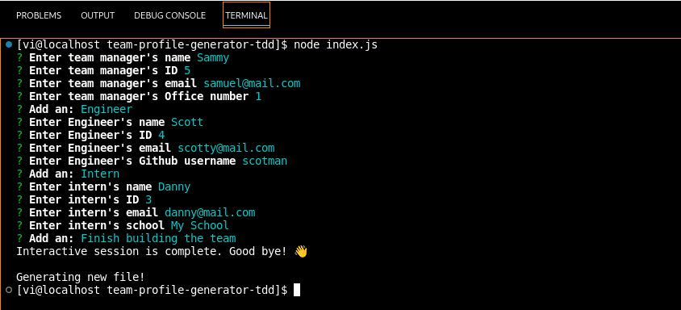
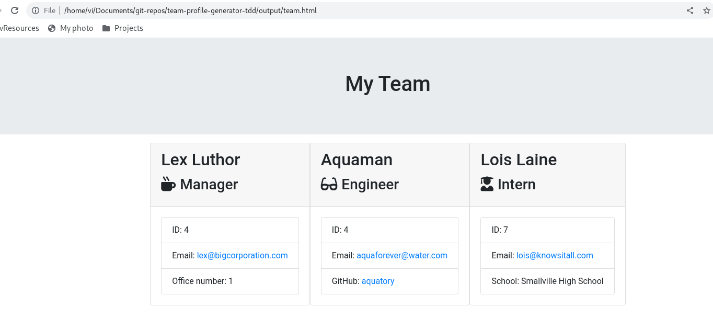

# Team profile generator via test driven development

## Description

This project was created to generate an HTML files from console inputs. The program will prompt questions about members of the team, and generate objects representing each team member. Those objects later will be rendered into HTML file and saved in `./output/team.txt` file.

Example of work with program:

  > 

After you are finished entering data, HTML file will be genereted. It will look something like this: 

  > 

## Table of Contents

1. [Description](#Description)
2. [Installation](#Installation)
3. [Usage](#Usage)
4. [License](#License)
5. [Contributing](#Contributing)
6. [Tests](#Tests)

## Installation

You will need to install dependecies. For that use the command:

`npm i`

## Usage

To use this progran run `node index.js` . You must be in the directory, where index.js is located.

## License

This program runs under MIT Licence.

## Contributing

Do fork and pull to contibute to project.

## Tests

Tests are added to test if classes created and work correctly. To run tests use `npm test`
